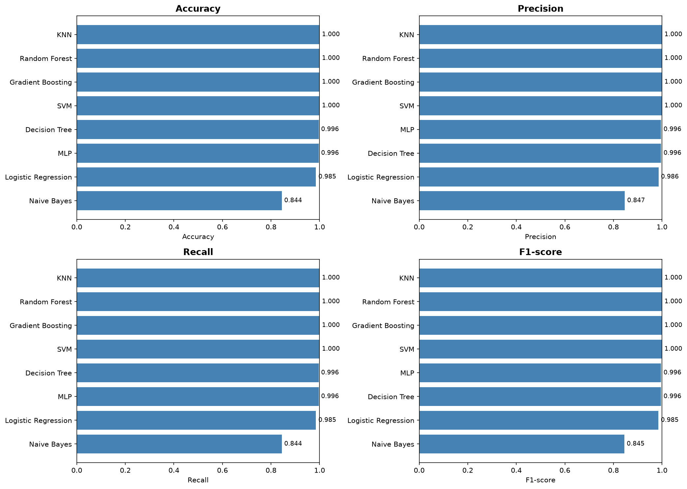
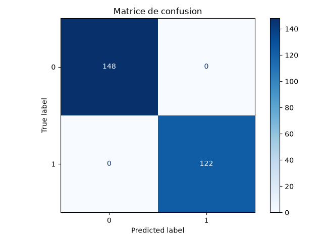
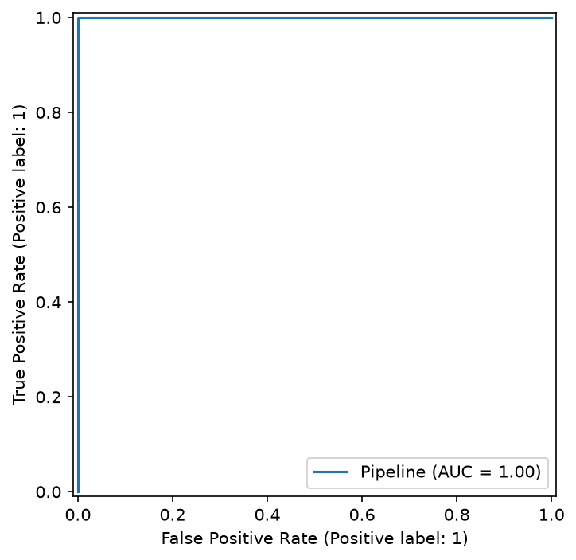

# 💵 Banknote Authentication - Détection de faux billets avec Machine Learning

## 📌 Description du projet

Ce projet consiste à développer un système de **détection automatique de faux billets** en utilisant des techniques de **Machine Learning supervisé (classification binaire)**.

L'objectif est de construire un modèle capable de prédire si un billet est :

- `0` : Faux billet
- `1` : Vrai billet

à partir de caractéristiques extraites d'images de billets :

- **Variance**
- **Skewness (asymétrie)**
- **Curtosis (aplatissement)**
- **Entropy (entropie)**

Plusieurs algorithmes de classification seront testés et comparés afin de sélectionner le meilleur modèle selon différentes métriques d'évaluation.

---

# 🎯 Objectifs

Les objectifs principaux de ce projet sont :

- Explorer et comprendre le dataset.
- Réaliser une analyse exploratoire des données (EDA).
- Préparer les données pour l'entraînement.
- Tester plusieurs modèles de classification.
- Comparer les performances des modèles.
- Optimiser le meilleur modèle avec une recherche d'hyperparamètres.
- Évaluer le modèle final avec différentes métriques.
- Sauvegarder le modèle entraîné pour effectuer de nouvelles prédictions.

---

# ⚙️ Installation

## 1. Cloner le projet

```bash
git clone https://github.com/Celestin-Dev/banknote-classify.git

cd banknote-classify
```

## 2. Créer l'environnement virtuel

```bash
python3 -m venv env
```

Activer l'environnement:

- Pour Windows

```bash

env\Scripts\activate

```

- Linux / Ubuntu

```bash

source env/bin/activate

```

## 3. Installer les dépendances

```bash

pip install -r requirements.txt

```

# 📊 Dataset

le dataset contient :

- **1372 observations**
- **variables**
- **caractéristiques numériques**
- **variable cible (class)**

Variables utilisées

| Variable | Description                   |
| -------- | ----------------------------- |
| variance | Variance de l'image du billet |
| skewness | Mesure de l'asymétrie         |
| curtosis | Mesure de l'aplatissement     |
| entropy  | Mesure de l'entropie          |
| class    | Classe du billet (0 ou 1)     |

---

# 🧪 Prétraitement

- Suppression des doublons du dataset (19 doublons détectés entre train/test avant nettoyage).
- Split train/test stratifié (80/20) réalisé après déduplication.
- Standardisation (`StandardScaler`) appliquée aux modèles sensibles à l'échelle (Logistic Regression, KNN, SVM, MLP), intégrée dans un `Pipeline` pour éviter toute fuite de données.
- Optimisation des hyperparamètres via `GridSearchCV` avec validation croisée stratifiée à 5 folds (`StratifiedKFold`), métrique `f1_weighted`.

---

# 📈 Résultat d'évaluation pour chaque des modèles



## ✅ Modèle retenu : KNN

Le modèle **KNN** obtient un score parfait (Accuracy = 1.00, AUC = 1.00) sur le jeu de test, confirmé après :

- suppression des doublons entre train et test,
- validation croisée à 10 folds sur l'ensemble du dataset,
- comparaison avec un modèle linéaire simple (Logistic Regression).

### Matrice de confusion (KNN)



Aucune erreur de classification : 0 faux positif, 0 faux négatif (148 vrais négatifs, 122 vrais positifs).

### Courbe ROC (KNN)



AUC = 1.00 — séparation parfaite entre les deux classes sur le jeu de test.

### Interprétation

Le score parfait ne provient pas d'une fuite de données ni d'un artefact méthodologique, mais de la **forte séparabilité linéaire** des classes dans ce dataset — un résultat connu et documenté pour le Banknote Authentication Dataset.

---

# 📉 Courbe d'apprentissage

## Objectif

La `learning_curve` permet d'observer l'évolution du score d'accuracy en fonction de la taille du jeu d'entraînement, pour détecter un éventuel sur-apprentissage (overfitting) ou sous-apprentissage (underfitting).

## Configuration

- Estimateur : pipeline `StandardScaler` + `KNN` (meilleurs hyperparamètres issus du `GridSearchCV`)
- Validation croisée : `StratifiedKFold(n_splits=5)`
- Tailles testées : de 10 % à 100 % du dataset, par paliers de 10 %
- Métrique : accuracy

## Graphique


## Résultat observé

- Les courbes d'entraînement et de validation sont **proches et élevées dès les premiers paliers** (≈ 0.99–1.00).
- Aucun écart significatif entre score train et score validation → **pas d'overfitting**.
- La courbe de validation reste stable et ne progresse plus après un certain seuil → **ajouter davantage de données n'améliorerait pas significativement le modèle**.

## Conclusion

Le modèle KNN généralise bien même avec peu de données d'entraînement, ce qui confirme la forte séparabilité du dataset. Le modèle est jugé fiable, stable et prêt à être utilisé (sauvegarde possible via `joblib` dans le models `best_model_knn.pkl`).
